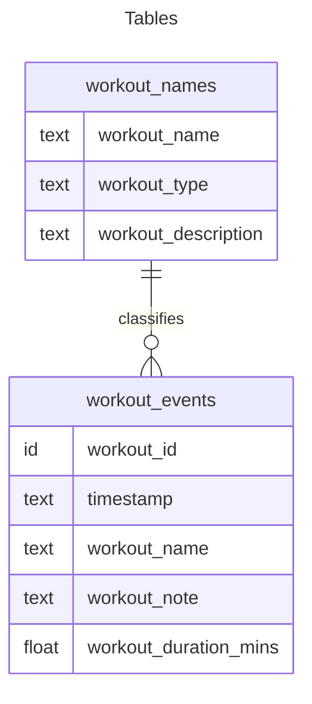

# About
This repo is being created as part of NW Missouri State University - 44608 Module 5. It is an introduction to **SQL** using Python.

Author: Aaron Gillespie

## Requirements (Spec)

From the [spec](https://github.com/denisecase/datafun-05-spec?tab=readme-ov-file), the requirements are:

1. Design a schema with 2+ related tables, including foreign key constraints.
    1.1. Document this schema in this README
2. Create a python script to create a database, define a schema, and insert records. 
3. Do additional operations - filter, query, insert, CRUD, modify the schema
4. Perform aggregations with queries
5. ...and potentially some other stuff. The spec indicates it is a work in progress.

# Documentation

## Organization

This repo contains two projects, a small project relating to BOOKS and AUTHORS (located in the `skill-drill` folder), and a slightly larger project relating to workouts. This documentation mostly refers to the latter.

### Folders
- `data` - contains actual data, csv files & the sqlite files
- `logs` - logs created by the logger I'm using (see the file `utils_logger.py`)
- `skill-drill` - code relevant to this week's skill drills, relating to BOOKS and AUTHORS
- `sql_create` - sqlite files demonstrating the basic ability to drop, create, and populate tables
- `sql_features` - sqlite files demonstrating slightly more advanced sql topics, updating and deleting records
- `sql_queries` - sqlite files demonstrating queries, filtering, joins, grouping, etc.


## Running Code

The Python files can be run iteratively, starting with any of `db01_setup`, `db02_features`, or `db03_queries`. Any assumptions made by the code are enforced *in* the code (aside from the existance of the sql script files, I guess).

### Example:

```shell
sqlite3 db03_queries.py
```

## Table Schema

Using GitHub's [integration](https://github.blog/developer-skills/github/include-diagrams-markdown-files-mermaid/) with [Mermaid.js](https://mermaid.js.org/syntax/entityRelationshipDiagram.html)

